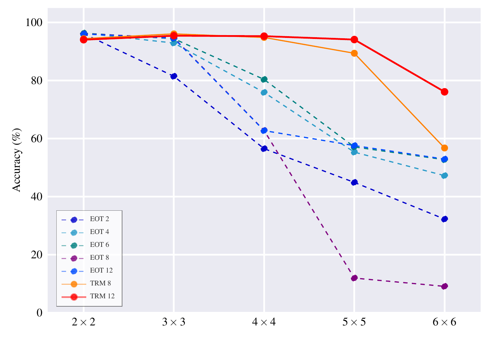

# Depth vs Recursion: Outperforming Transformers in Jigsaw Reconstruction

[](https://openreview.net/forum?id=1zDG1o16xB)
[](https://www.python.org/)
[](https://pytorch.org/)

Official implementation of the ICLR 2026 Workshop ''Recursive Self-Improvement'' paper
[''Depth vs Recursion: Outperforming Transformers in Jigsaw Reconstruction''](https://openreview.net/forum?id=1zDG1o16xB).

> **TL;DR:**
> Tiny Recursive Models (TRM) solve jigsaw puzzles that vanilla Transformers cannot,
> using the same ~0.7M parameter budget — by iteratively refining a latent "thought" vector
> instead of adding more layers.

<table>
  <tr>
    <td></td>
    <td></td>
    <td></td>
    <td></td>
  </tr>
  <tr>
    <td></td>
    <td></td>
    <td></td>
    <td></td>
  </tr>
  <tr>
    <td align="center"><em>t = 0</em></td>
    <td align="center"><em>t = 1</em></td>
    <td align="center"><em>t = 2</em></td>
    <td align="center"><em>t = 3</em></td>
  </tr>
</table>

## Overview

We benchmark **Tiny Recursive Models (TRM)** against
standard **Encoder-Only Transformers (EOT)** on jigsaw puzzle reconstruction
across grid sizes from 2×2 to 6×6. Key findings:

- Both architectures perform comparably on simple grids (≤3×3, ~95% accuracy)
- EOT performance collapses on complex grids; TRM maintains **94.15% accuracy on 5×5**
- Increasing EOT depth does **not** recover performance — deeper EOTs fail to converge on 5×5 and 6×6
- TRM exhibits **"abrupt learning"** phase transitions, delayed predictably as puzzle complexity grows

---

## Repository Structure

```
.
├── dataset.py        # ImagePuzzle dataset logic
├── model.py          # Model definitions
├── puzzle.py         # Fisher–Yates permutation encoding and decoding
├── utils.py          # Factory functions and training step logic
├── main.py           # Training entry point
└── requirements.txt
```

---

## Setup

### 1. Install dependencies

```bash
pip install -r requirements.txt
```

### 2. Configure dataset path

Create a `.env` file in the project root:

```env
DATASETS=/path/to/your/datasets
```

Or set the `DATASETS` variable at `utils.py` file.

The code expects the COCO dataset at:

```
$DATASETS/COCO/2017/
├── train/
└── test/
```

---

## Training

```bash
python -m main
```

Runs are saved to `run/<name>/` with the following structure:

```
run/trm-P5-T16-D128-F512-H8-L2-s8-t2-n3-coco/
├── config.json
├── train/
│   ├── 00.pt
│   └── ...
└── test/
    ├── 00.pt
    └── ...
```

Each checkpoint contains logits, labels, and (for training checkpoints) model and optimizer state dicts.

### Key hyperparameters

| Parameter     | Description                                                     |
|---------------|-----------------------------------------------------------------|
| `puzzle_size` | Grid size (e.g. `5` → 5×5 puzzle)                               |
| `tile_size`   | Patch size in pixels (default: `16`)                            |
| `model_dim`   | Transformer hidden dimension                                    |
| `layer_num`   | Number of Transformer layers                                    |
| `s`           | Number of macro-steps of deep-supervision (TRM only)            |
| `t`           | Number of outer "thinking" iterations per macro-step (TRM only) |
| `n`           | Number of inner "thinking" iterations per outer loop (TRM only) |

---

## Results

### Patch-level accuracy across grid sizes

<table>
  <tr>
    <td></td>
    <td>

| Model      | 2×2   | 3×3   | 4×4   | 5×5       | 6×6       |
|------------|-------|-------|-------|-----------|-----------|
| EOT 2      | 96.18 | 81.49 | 56.54 | 44.92     | 32.27     |
| EOT 4      | 96.38 | 92.95 | 75.93 | 55.34     | 47.25     |
| EOT 6      | 96.34 | 94.45 | 80.40 | 57.14     | 52.74     |
| EOT 8      | 96.08 | 94.60 | 62.76 | 57.61     | 52.95     |
| EOT 12     | 96.14 | 94.74 | 62.82 | 11.94     | 9.09      |
| **TRM 8**  | 94.46 | 96.11 | 94.88 | 89.43     | 56.78     |
| **TRM 12** | 94.10 | 95.47 | 95.32 | **94.15** | **76.14** |

  </td>
  </tr>
</table>

The Index of EOT shows the number of layers, while TRM means number of macro-steps.